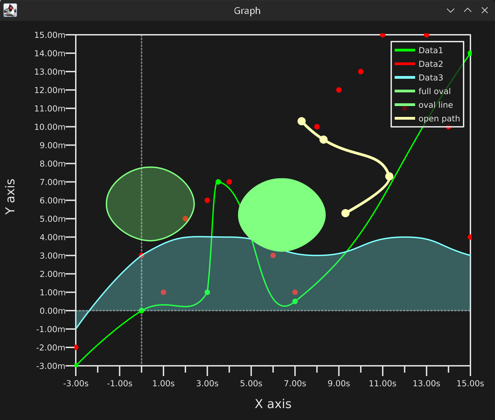

# JLineGraph

Small library to draw line graphs in java



## Install

Add MCHV repository to your pom.xml

```xml
<repositories>
  <repository>
    <id>mchv</id>
    <name>MCHV Apache Maven Packages</name>
    <url>https://mvn.mchv.eu/repository/mchv/</url>
  </repository>
</repositories>
```

Add the dependency to your pom.xml

```xml
<dependencies>
  <dependency>
    <groupId>it.cavallium</groupId>
    <artifactId>jlinegraph</artifactId>
    <version>1.0</version>
  </dependency>
</dependencies>
```
